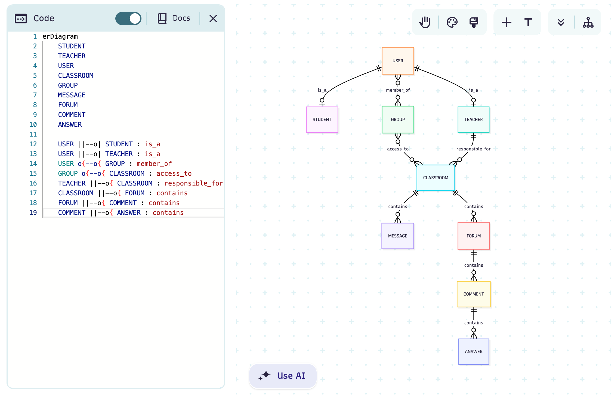

# Oppgavesett 1.4: Databasemodell og implementasjon for Nettbasert Undervisning

I dette oppgavesettet skal du designe en database for et nettbasert undervisningssystem. Les casen nøye og løs de fire deloppgavene som følger.

Denne oppgaven er en øving og det forventes ikke at du kan alt som det er spurt etter her. Vi skal gå gjennom mange av disse tingene detaljert i de nærmeste ukene. En lignende oppbygging av oppgavesettet, er det ikke helt utelukket at, skal bli brukt i eksamensoppgaven.

Du bruker denne filen for å besvare deloppgavene. Du må eventuelt selv finne ut hvordan du kan legge inn bilder (images) i en Markdown-fil som denne. Da kan du ta et bilde av dine ER-diagrammer, legge bildefilen inn på en lokasjon i repository og henvise til filen med syntaksen i Markdown. 

Det er anbefalt å tegne ER-diagrammer med [mermaid.live](https://mermaid.live/) og legge koden inn i Markdown (denne filen) på følgende måte:
```
```mermaid
erDiagram
    studenter 
    ...
``` 
Det finnes bra dokumentasjon [EntityRelationshipDiagram](https://mermaid.js.org/syntax/entityRelationshipDiagram.html) for hvordan tegne ER-diagrammer med mermaid-kode. 

## Case: Databasesystem for Nettbasert Undervisning

Det skal lages et databasesystem for nettbasert undervisning. Brukere av systemet er studenter og lærere, som alle logger på med brukernavn og passord. Det skal være mulig å opprette virtuelle klasserom. Hvert klasserom har en kode, et navn og en lærer som er ansvarlig.

Brukere kan deles inn i grupper. En gruppe kan gis adgang ("nøkkel") til ett eller flere klasserom.

I et klasserom kan studentene lese beskjeder fra læreren. Hvert klasserom har også et diskusjonsforum, der både lærere og studenter kan skrive innlegg. Til et innlegg kan det komme flere svarinnlegg, som det igjen kan komme svar på (en hierarkisk trådstruktur). Både beskjeder og innlegg har en avsender, en dato, en overskrift og et innhold (tekst).

## Del 1: Konseptuell Datamodell

**Oppgave:** Beskriv en konseptuell datamodell (med tekst eller ER-diagram) for systemet. Modellen skal kun inneholde entiteter, som du har valgt, og forholdene mellom dem, med kardinalitet. Du trenger ikke spesifisere attributter i denne delen.

**Ditt svar:***
Entiteter:
    STUDENT
    TEACHER
    USER
    CLASSROOM
    GROUP
    MESSAGE
    FORUM
    COMMENT
    ANSWER

Kardinalitet:
    USER ||--o| STUDENT : is_a
    USER ||--o| TEACHER : is_a
    USER o{--o{ GROUP : member_of
    GROUP o{--o{ CLASSROOM : access_to
    TEACHER ||--o{ CLASSROOM : responsible_for     
    CLASSROOM ||--o{ MESSAGE : contains
    CLASSROOM ||--o{ FORUM : contains
    FORUM ||--o{ COMMENT : contains
    COMMENT ||--o{ ANSWER : contains

- En student må være én bruker; en bruker kan være 0 eller 1 student.
- En lærer må være én bruker; en bruker kan være 0 eller 1 lærer.
- En bruker kan være knytett til en eller flere grupper, en gruppe kan ha ingen eller mange brukere.
- Mange grupper kan ha tilgang til mange klasserom, mange klasserom kan ha mange grupper.
- Et klasserom må ha en ansvarlig lærer, en lærer kan være snavrlig for 0 eller mange klasserom
- et klasserom kan ha o eller mange meldinger, en melding kan kun være knytett til et klasserom. Det samme gjheøder forum.
- Et forum kan ha mange eller ingen kommentarer, en kommentar kan kun være knyttet til et forum.
- En kommentar kan ha mange eller ingen svar, men et svar kan kun være knyttet til en kommentar.



## Del 2: Logisk Skjema (Tabellstruktur)

**Oppgave:** Oversett den konseptuelle modellen til en logisk tabellstruktur. Spesifiser tabellnavn, attributter (kolonner), datatyper, primærnøkler (PK) og fremmednøkler (FK). Tegn et utvidet ER-diagram med [mermaid.live](https://mermaid.live/) eller eventuelt på papir.

**Ditt svar:***
erDiagram
    USER {
        varchar(40) username PK
        varchar(40) password
    }
    STUDENT {
        varchar(40) username PK, FK
        varchar(40) firstname        
        varchar(40) lastname
    }
    TEACHER {        
    varchar(40) username PK, FK
        varchar(40) firstname        
        varchar(40) lastname        
    }    
    GROUP {
        int group_id PK
    }
    CLASSROOM {
        int classroom_id PK
        varchar(40) classroom_name
        varchar(40) teacher_username FK
    }
    MESSAGE {
        int message_number PK
        int classroom_id FK
        varchar(200) message_text
        varchar(40) teacher_username FK
    }
    FORUM {
        int forum_number PK
        int classroom_id FK
        TIMESTAMP created
        varchar(50) forum_title
        varchar(200) forum_text
    }
    COMMENT {
        int comment_number PK
        int forum_number FK
        TIMESTAMP posted
        varchar(50) comment_title
        varchar(200) comment_text
        varchar(40) username FK

    }
    ANSWER {
        int answer_number PK
        int comment_number FK
        TIMESTAMP posted
        varchar(50) answer_title
        varchar(200) answer_text
        varchar(40) username FK
    }

Her er det også en koblingstabbel mellom mange til maneg relasjonen mellonm group og classroom:
    group_classroom_access {
        int group_id PK, FK
        int classroom_id PK, FK
    }

.png)

## Del 3: Datadefinisjon (DDL) og Mock-Data

**Oppgave:** Skriv SQL-setninger for å opprette tabellstrukturen (DDL - Data Definition Language) og sett inn realistiske mock-data for å simulere bruk av systemet.

**Ditt svar:***
CREATE TABLE IF NOT EXISTS user (
    user_id SERIAL UNIQUE
    username VARCHAR(40) PRIMARY KEY,
    password VARCHAR(40) NOT NULL
);

CREATE TABLE IF NOT EXISTS student (
    username VARCHAR(40) PRIMARY KEY REFERENCES user(username),
    firstname VARCHAR(40) NOT NULL,
    lastname VARCHAR(40) NOT NULL
);

CREATE TABLE IF NOT EXISTS teacher (
    username VARCHAR(40) PRIMARY KEY REFERENCES user(username),
    firstname VARCHAR(40) NOT NULL,
    lastname VARCHAR(40) NOT NULL
);

CREATE TABLE IF NOT EXISTS groups (
    group_id SERIAL PRIMARY KEY
);

CREATE TABLE IF NOT EXISTS student_group (
    username VARCHAR(40) NOT NULL REFERENCES student(username),
    group_id INT NOT NULL REFERENCES groups(group_id),
    PRIMARY KEY (username, group_id)
);


CREATE TABLE IF NOT EXISTS classroom (
    classroom_id SERIAL PRIMARY KEY,
    classroom_name VARCHAR(40) UNIQUE,
    teacher_username VARCHAR(40) NOT NULL REFERENCES teacher(username)
);

CREATE TABLE IF NOT EXISTS message (
    message_number SERIAL PRIMARY KEY,
    classroom_id INT NOT NULL REFERENCES classroom(classroom_id),
    message_text TEXT NOT NULL,
    teacher_username VARCHAR(40) NOT NULL REFERENCES teacher(username),
    created_at TIMESTAMP DEFAULT CURRENT_TIMESTAMP
);

CREATE TABLE IF NOT EXISTS forum (
    forum_number SERIAL PRIMARY KEY,
    classroom_id INT NOT NULL REFERENCES classroom(classroom_id),
    created_at TIMESTAMP DEFAULT CURRENT_TIMESTAMP,
    forum_title VARCHAR(50) NOT NULL,
    forum_text TEXT NOT NULL,
    username VARCHAR(40) NOT NULL REFERENCES user(username)
);

CREATE TABLE IF NOT EXISTS comment (
    comment_number SERIAL PRIMARY KEY,
    forum_number INT REFERENCES forum(forum_number),
    created_at TIMESTAMP DEFAULT CURRENT_TIMESTAMP,
    comment_title VARCHAR(50) NOT NULL,
    comment_text TEXT NOT NULL,
    username VARCHAR(40) NOT NULL REFERENCES user(username)
);

CREATE TABLE IF NOT EXISTS answer (
    answer_number SERIAL PRIMARY KEY,
    comment_number INT NOT NULL REFERENCES comment(comment_number),
    created_at TIMESTAMP DEFAULT CURRENT_TIMESTAMP,
    answer_title VARCHAR(50) NOT NULL,
    answer_text TEXT NOT NULL,
    username VARCHAR(40) NOT NULL REFERENCES user(username)
);

CREATE TABLE IF NOT EXISTS group_classroom_access (
    group_id INT NOT NULL REFERENCES groups(group_id),
    classroom_id INT NOT NULL REFERENCES classroom(classroom_id),
    PRIMARY KEY (group_id, classroom_id)
);

------------------------------------- TEST-DATA ---------------------------------------------

INSERT INTO user (username, password)
VALUES ('alice01', 'password123'), ('bert98', '63949472'), ('teacher101', 'userpassowrd');

INSERT INTO student (username, firstname, lastname)
VALUES ('alice01', 'Alice', 'Anderson'), ('bert98', 'Bert', 'Ernie');

INSERT INTO teacher (username, firstname, lastname)
VALUE ('teacher101', 'Leonora', 'Carlson');

INSERT INTO groups (group_id) VALUES (1), (2), (3);

INSERT INTO student_group (username, group_id)
VALUES 
    ('alice01', 1),
    ('bert98', 1),
    ('bert98', 2),
    ('alice01', 2),
    ('alice01', 3);

INSERT INTO classroom (classroom_name, teacher_username)
VALUES ('Math101', 'teacher101'),
       ('Physics101', 'teacher101');

INSERT INTO group_classroom_access (group_id, classroom_id)
VALUES (1, 1), (2, 2);

INSERT INTO message (classroom_id, message_text, teacher_username)
VALUES (1, 'Welcome to Math101', 'teacher101');

INSERT INTO forum (classroom_id, forum_title, forum_text, username)
VALUES (1, 'Introductions', 'Say hello to your classmates!', alice01);

INSERT INTO comment (forum_number, comment_title, comment_text, username)
VALUES (1, 'Hi everyone', 'Excited to be here!', 'alice01');

INSERT INTO answer (comment_number, answer_title, answer_text, username)
VALUES (1, 'Welcome!', 'Glad to have you here!', 'teacher101');


## Del 4: Spørringer mot Databasen

**Oppgave:** Skriv SQL-spørringer for å hente ut informasjonen beskrevet under. For hver oppgave skal du levere svar med både relasjonsalgebra-notasjon og standard SQL.

### 1. Finn de 3 nyeste beskjeder fra læreren i et gitt klasserom (f.eks. klasserom_id = 1).

*   **Relasjonsalgebra:**
    > 

*   **SQL:**
    ```
    select message_text, teacher_username, classroom_id from message where classroom_id = 1 order by created_at desc limit 3;
    ```

### 2. Vis en hel diskusjonstråd startet av en spesifikk student (f.eks. avsender_id = 2).

*   **Relasjonsalgebra**
    > Trenger ikke å skrive en relasjonsalgebra setning her, siden det blir for komplekst og uoversiktlig. 

*   **SQL (med `WITH RECURSIVE`):**

    Du kan vente med denne oppgaven til vi har gått gjennom avanserte SQL-spørringer (tips: må bruke en rekursiv konstruksjon `WITH RECURSIVE diskusjonstraad AS (..) SELECT FROM diskusjonstraad ...`)
    ```
    with recursive diskusjonstraad as (
        SELECT forum_number AS id, NULL AS parent_id, forum_title AS title, forum_text AS text, username, 1 AS level 
        FROM forum where username = 'alice01'

        UNION ALL
        SELECT c.comment_number AS id, c.forum_number AS parent_id, c.comment_title AS title, c.comment_text AS text, c.username, d.level + 1 AS level
        FROM comment c 
        JOIN diskusjonstraad d ON c.forum_number = d.id

        UNION ALL
        SELECT a.answer_number AS id, a.comment_number AS parent_id, a.answer_title AS title, a.answer_text AS text, a.username, d.level + 1 AS level
        FROM answer a 
        JOIN diskusjonstraad d ON a.comment_number = d.id
    )
    SELECT * FROM diskusjonstraad order by level; 
    
    ```


### 3. Finn alle studenter i en spesifikk gruppe (f.eks. gruppe_id = 1).

*   **Relasjonsalgebra:**
    > 

*   **SQL:**
    ```
    SELECT g.username, s.firstname, s.lastname 
    FROM student_group g
    JOIN students s ON s.username = g.username 
    WHERE group_id. = 1;
    
    ```

### 4. Finn antall grupper.

*   **Relasjonsalgebra (med aggregering):**
    > 

*   **SQL:**
    ```
    SELECT COUNT(group_id) FROM groups;
    
    ```

## Del 5: Implementer i postgreSQL i din Docker container

**Oppgave:** Gjenbruk `docker-compose.yml` fra Oppgavesett 1.3 (er i denne repositorien allerede, så du trenger ikke å gjøre noen endringer) og prøv å legge inn din skript for opprettelse av databasen for nettbasert undervsining med noen testdata i filen `01-init-database.sql` i mappen `init-scripts`. Du trenger ikke å opprette roller. 

Lagre alle SQL-spørringene dine fra oppgave 4 i en fil `oppgave4_losning.sql` i mappen `test-scripts` for at man kan teste disse med kommando:

```bash
docker-compose exec postgres psql -U admin -d data1500_db -f test-scripts/oppgave4_losning.sql
```
